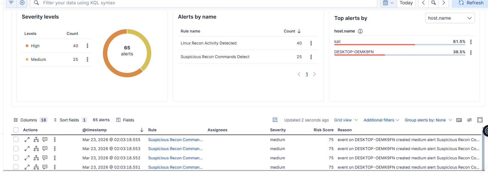
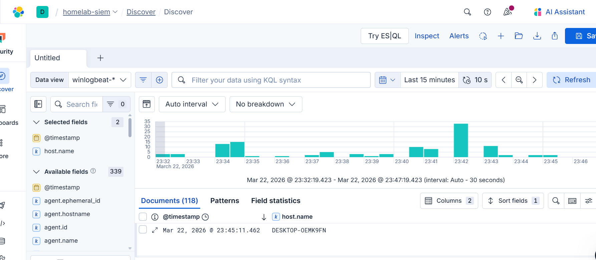
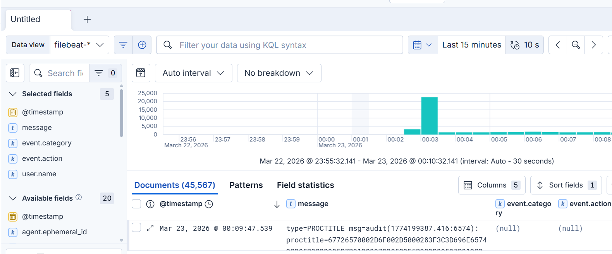
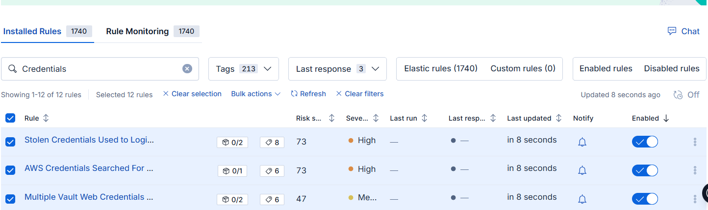
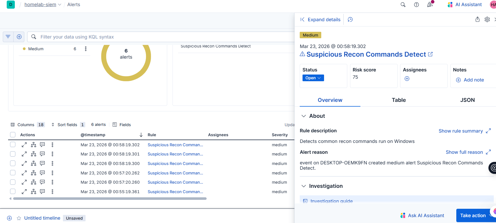
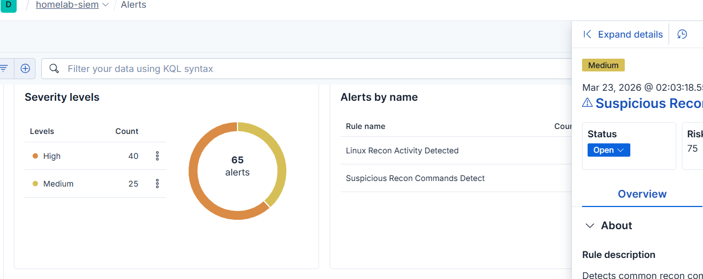

# SOC Homelab — Hybrid SIEM with Elastic Stack

## Overview
A fully functional Security Operations Center (SOC) homelab built from scratch using 
two virtual machines shipping logs to a cloud SIEM for real-time threat detection.

## Architecture
- **Windows 10 VM** — victim/monitored machine
- **Kali Linux VM** — attacker machine
- **Elastic Cloud (SIEM)** — log aggregation, detection, and alerting

## Tools Used
| Tool | Purpose |
|---|---|
| Sysmon | Deep Windows process/network/file logging |
| Winlogbeat | Ships Windows logs to Elastic |
| Auditd | Linux kernel-level audit logging |
| Filebeat | Ships Kali logs to Elastic |
| Elastic SIEM | Log storage, detection rules, alerting |
| Metasploit | Attack simulation |
| Netcat | Reverse shell handler |

## What I Built
### Defensive (Blue Team)
- Configured Sysmon with SwiftOnSecurity ruleset on Windows
- Configured auditd with custom rules on Kali Linux
- Shipped logs from both machines to Elastic Cloud in real time
- Enabled 1740+ prebuilt MITRE ATT&CK detection rules
- Built custom detection rules matching actual log field structure

### Offensive (Red Team)
- Conducted network reconnaissance with Nmap from Kali
- Performed SMB enumeration with enum4linux
- Executed a Python reverse shell from Windows back to Kali
- Ran post-exploitation commands (whoami, systeminfo, net user)

### Detection & Response
- Custom rule detected recon commands within 60 seconds
- Alerts fired in Kibana SIEM with host attribution
- Full audit trail of attacker commands in Discover

## Attack Chain Demonstrated
```
Kali VM ──[reverse shell]──► Windows VM
                                  │
                            Sysmon logs
                                  │
                            Winlogbeat
                                  │
                          Elastic Cloud
                                  │
                         Alert fired ✅
```

## Key Detections Built
- Suspicious recon commands (whoami, net, systeminfo, wmic)
- Linux recon activity (cat /etc/passwd, sudo -l, find -perm)
- Process creation monitoring via Sysmon Event ID 1
- Network connection logging via Sysmon Event ID 3

## Skills Demonstrated
- SIEM deployment and configuration
- Log ingestion pipeline (Beats → Elasticsearch)
- Detection engineering (custom KQL rules)
- Network configuration (Host-Only + NAT in VirtualBox)
- Linux and Windows system administration
- Basic penetration testing with Metasploit and Netcat
- MITRE ATT&CK framework awareness

## Network Topology
```
[Host Machine]
      │
      ├── Windows 10 VM (192.168.217.8)
      │         Sysmon + Winlogbeat
      │
      └── Kali Linux VM (192.168.217.7)
                Auditd + Filebeat
                
Both VMs → Elastic Cloud (GCP Jakarta)
```

## Screenshots

### Alerts Dashboard — 65 alerts detected across both hosts


### Windows Logs — Winlogbeat ingesting Sysmon events


### Kali Logs — Filebeat ingesting auditd events  


### 1740 Detection Rules Installed


### First Alert — Suspicious Recon Commands on Windows


### Alert Investigation Panel



## References
- [Elastic SIEM Documentation](https://www.elastic.co/guide/en/security/current/index.html)
- [SwiftOnSecurity Sysmon Config](https://github.com/SwiftOnSecurity/sysmon-config)
- [MITRE ATT&CK Framework](https://attack.mitre.org/)
